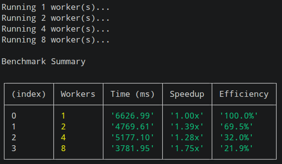

# CPU Intensive Tasks in Node.js using Worker Threads

> Understanding how to scale CPU-intensive workloads in Node.js by building a Mandelbrot Set renderer, comparing single-threaded execution with Worker Threads, and benchmarking their performance.

## 📖 Overview

Node.js is well known for its event-driven, non-blocking architecture, making it an excellent choice for I/O-intensive applications. However, CPU-intensive tasks can block the event loop, causing the entire application to become unresponsive.

This project demonstrates that problem by generating a **Mandelbrot Set** image.

The project starts with a **single-threaded implementation** and then evolves into a **multi-threaded implementation** using **Worker Threads**.

Finally, the performance of both implementations is benchmarked to compare execution times and understand how Worker Threads utilize multiple CPU cores.

---

## 📂 Project Structure

```text
src/
│
├── single/
│   ├── index.js
│   └── mandelbrot.js
│
├── multi/
│   ├── index.js
│   └── worker.js
│
├── benchmark/
│   └── benchmark.js
│
└── utils/
    ├── pngwriter.js
    └── timer.js

output/
```

---

# ⚙️ Installation

Clone the repository.

```bash
git clone https://github.com/yourusername/CPU-Intensive-Task-With-Node-JS-Using-Worker-Threads-Concept.git
```

Move into the project.

```bash
cd CPU-Intensive-Task-With-Node-JS-Using-Worker-Threads-Concept
```

Install dependencies.

```bash
npm install
```

---

# ▶️ Running the Project

## Single Thread

```bash
npm run single
```

This renders the Mandelbrot image using a single JavaScript thread.

The generated image will be available in:

```text
output/single.png
```

---

## Worker Threads

```bash
npm run multi
```

This divides the rendering work across multiple Worker Threads.

The generated image will be available in:

```text
output/multi.png
```

---

## Run Benchmarks

```bash
npm run benchmark
```

The benchmark automatically runs the renderer with different numbers of workers and prints a comparison table.

Example:

```text
Running 1 Worker...

Running 2 Workers...

Running 4 Workers...

Running 8 Workers...
```

---

# 📊 Benchmark Results

> 

---

# 🖼 Generated Images

### Single Thread Output

> 

---

### Worker Thread Output

> 

---

# 🧠 What Problem Does This Solve?

Node.js executes JavaScript on a single thread.

For CPU-intensive operations such as:

* Image rendering
* Image processing
* Video encoding
* Encryption
* Compression
* Scientific calculations

the event loop becomes blocked.

While a CPU-intensive task is running, Node.js cannot efficiently process incoming requests.

Worker Threads solve this problem by executing JavaScript on additional threads.

Instead of one thread performing all computations, multiple workers process different portions of the workload simultaneously, allowing Node.js to utilize multiple CPU cores.

---

# ⚠️ Worker Threads Are Not a Silver Bullet

Creating a new Worker for every incoming request introduces overhead.

Each Worker requires:

* Thread creation
* Memory allocation
* Initialization
* Scheduling

Creating hundreds or thousands of Workers under heavy traffic can become expensive.

---

# ✅ The Better Approach: Worker Pool

A Worker Pool creates a fixed number of workers when the application starts.

Instead of creating new workers repeatedly:

1. Incoming tasks are added to a queue.
2. Idle workers pick up the next available task.
3. Completed workers return to the pool.
4. Workers are reused instead of recreated.

Benefits include:

* Lower thread creation overhead
* Better memory utilization
* Higher throughput
* Predictable performance
* Improved scalability

This project lays the foundation for understanding why Worker Pools are commonly used in production systems.

---

* Worker Pool implementation
* Dynamic task scheduling
* SharedArrayBuffer
* Transferable Objects
* Performance visualization
* Load balancing
* Thread-safe task queues
* HTTP API for rendering
* Docker support
* Automated benchmarking reports

---

# 🙏 Acknowledgements

A heartfelt thank you to **Rakesh** for creating such an outstanding course. Building this project while learning the concepts made it much easier to understand how Node.js handles CPU-intensive workloads, Worker Threads, and performance optimization through practical implementation.

---

# ⭐ If You Found This Helpful

If this project helped you understand Worker Threads or CPU-intensive processing in Node.js, consider giving the repository a ⭐. It motivates me to continue building and sharing more backend engineering projects.

Happy Coding! 🚀
